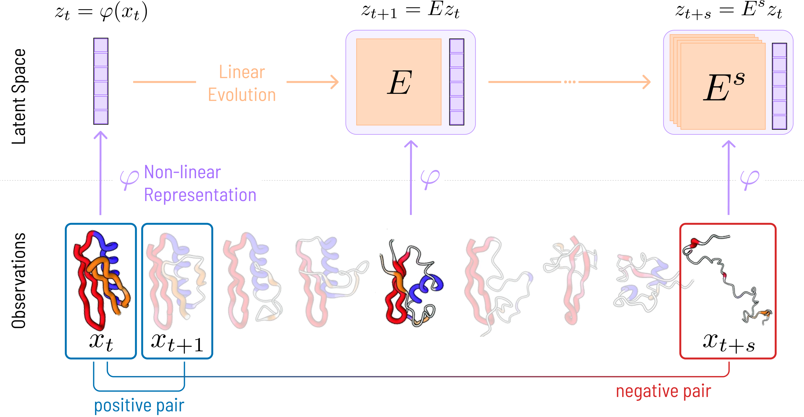

# EncoderOps

This is the official codebase of the paper

**Self-Supervised Evolution Operator Learning for High-Dimensional Dynamical Systems**, ICLR 2026 [OpenReview](https://openreview.net/forum?id=Ku3kLJle7Q)

**Authors:** Giacomo Turri, Luigi Bonati, Kai Zhu, Massimiliano Pontil, Pietro Novelli  
**Affiliations:** Istituto Italiano di Tecnologia, Zhejiang University, University College London

**Resources:** [Project Page](https://pietronvll.github.io/encoderops/) · [GitHub](https://github.com/pietronvll/encoderops) · [HF Models (CSML-IIT)](https://huggingface.co/CSML-IIT/encoderops) · [HF Models (pnovelli)](https://huggingface.co/pnovelli/encoderops) · [HF Datasets (pnovelli)](https://huggingface.co/datasets/pnovelli/encoderops)

## Overview

We introduce an end-to-end approach to learn the evolution operators of large-scale non-linear dynamical systems, such as those describing complex natural phenomena. Evolution operators are particularly well-suited for analyzing systems that exhibit spatio-temporal patterns and have become a key analytical tool across various scientific communities. As terabyte-scale weather datasets and simulation tools capable of running millions of molecular dynamics steps per day are becoming commodities, our approach provides an effective tool to make sense of them from a data-driven perspective. The core of it lies in a remarkable connection between self-supervised representation learning methods and the recently established learning theory of evolution operators.

We deploy the approach across multiple scientific domains, including the folding dynamics of small proteins, the binding process of drug-like molecules in host sites, and autonomous pattern discovery in climate data. This repository exposes the corresponding training code and analysis notebooks.



## Installation

We use `uv` for environment management.

```bash
uv sync --no-install-package torch-scatter
uv sync --no-build-isolation
```

Create a default dataset location if you want the trainers to read `DATA_PATH` automatically:

```bash
cp .env.example .env
```

The current defaults in `src.configs.Configs` are:
- `offline=True`
- `accelerator="auto"`
- `num_devices=1`

This makes local runs account-free by default. For larger jobs you will usually override the accelerator, number of devices, batch size, or data path.

## Checkpoints

Published checkpoints are available on Hugging Face:
- Models: `CSML-IIT/encoderops`
- Models: `pnovelli/encoderops`

The analysis notebooks now load Hugging Face checkpoints by default through a small checkpoint-selection cell near the top of each notebook. To use your own trained checkpoints instead, set:

```python
checkpoint_source = "local"
local_checkpoint_root = Path("/path/to/your/checkpoints")
```

Representative checkpoint paths used in the notebooks include:
- ENSO: `ENSO/EvOp_CESM.pt`
- Calixarene G2: `calixarene-G2/checkpoints/last.ckpt`
- Calixarene G1+3: `calixarene-G1+3/checkpoints/last.ckpt`
- TRP-Cage: `encoderops-2J0F/checkpoints/last.ckpt`
- Lorenz63 families: `lorenz63/EvolutionOperator_dataopt`, `lorenz63/VAMPNets`, `lorenz63/DPNets`, `lorenz63/DAE`, `lorenz63/CAE`

## Datasets

The released datasets are hosted on Hugging Face:
- Full public dataset release: `pnovelli/encoderops`
- SST files are also mirrored under `CSML-IIT/encoderops`

Datasets used by the code include:
- `SST/sst_monthly.nc`
- `SST/cesm_sst_regridded_1.5deg_850-2005.nc`
- `lorenz63/lorenz63_dataset.nc`
- `calixarene/...`

For **TRP-Cage**, raw DESRES trajectories are not redistributed as part of the easy public setup. To retrain from raw data, request the original data from DESRES and preprocess it as described below.

## Training

The trainer entry points are the public interface for reproduction and extension.

### Available trainer presets

```bash
uv run --env-file=.env -- python -m exps.ENSO.trainer ENSO_ORAS5 --help
uv run --env-file=.env -- python -m exps.ENSO.trainer ENSO_CESM --help
uv run --env-file=.env -- python -m exps.calixarene.trainer G2 --help
uv run --env-file=.env -- python -m exps.calixarene.trainer G13 --help
uv run --env-file=.env -- python -m exps.trpcage.trainer trp-cage --help
uv run --env-file=.env -- python -m exps.lorenz63.trainer l63 --help
```

### Launch training

Run the same commands without `--help`:

```bash
uv run --env-file=.env -- python -m exps.ENSO.trainer ENSO_ORAS5
uv run --env-file=.env -- python -m exps.ENSO.trainer ENSO_CESM
uv run --env-file=.env -- python -m exps.calixarene.trainer G2
uv run --env-file=.env -- python -m exps.calixarene.trainer G13
uv run --env-file=.env -- python -m exps.trpcage.trainer trp-cage
uv run --env-file=.env -- python -m exps.lorenz63.trainer l63
```

### Programmatic configuration

If you prefer Python over CLI overrides:

```python
from exps.ENSO.trainer import main
from src.configs import defaults

cfg = defaults["ENSO_ORAS5"][1]
cfg.data_args.data_path = "/path/to/datasets"
cfg.offline = False
cfg.accelerator = "cuda"
cfg.num_devices = 1
main(cfg)
```

The same pattern works for the other experiments by importing the corresponding `main()` function and selecting the relevant preset from `src.configs.defaults`.

### TRP-Cage preprocessing

Before training TRP-Cage from raw data:
- request the trajectory data from the DESRES distribution page;
- extract `DESRES-Trajectory_2JOF-0-protein.tar.xz` inside your dataset root;
- copy [`exps/trpcage/2JOF-0-protein.pdb`](exps/trpcage/2JOF-0-protein.pdb) to `DATA_PATH/DESRES-Trajectory_2JOF-0-protein/2JOF-0-protein/2JOF-0-protein.pdb`;
- preprocess the LMDB dataset:

```bash
uv run --env-file=.env -- python -m scripts.to_lmdb --protein-id 2JOF
```

## Notebooks

The notebooks are retained for analysis and figure reproduction:
- [`exps/ENSO/analysis.ipynb`](exps/ENSO/analysis.ipynb)
- [`exps/calixarene/analysis.ipynb`](exps/calixarene/analysis.ipynb)
- [`exps/trpcage/analysis.ipynb`](exps/trpcage/analysis.ipynb)
- [`exps/lorenz63/analysis.ipynb`](exps/lorenz63/analysis.ipynb)

These notebooks:
- default to published Hugging Face checkpoints;
- can switch to local checkpoints through the top configuration cell;
- are secondary to the trainer entry points for actual reproduction.

Launch them with:

```bash
uv run -- jupyter lab
```

## Repository Structure

- `src/`: shared configs, models, losses, data modules, checkpoint helpers, utilities
- `exps/`: experiment-specific trainers and analysis notebooks
- `scripts/`: preprocessing and cluster-launch helpers
- `assets/`: small curated images used by the README

## Citation

If you find this codebase useful in your research, please cite the following paper:

```bibtex
@inproceedings{turri2026selfsupervised,
  title={Self-Supervised Evolution Operator Learning for High-Dimensional Dynamical Systems},
  author={Turri, Giacomo and Bonati, Luigi and Zhu, Kai and Pontil, Massimiliano and Novelli, Pietro},
  booktitle={The Fourteenth International Conference on Learning Representations},
  year={2026},
  url={https://openreview.net/forum?id=Ku3kLJle7Q}
}
```

## License

This repository is released under the MIT License. See [LICENSE](LICENSE).
